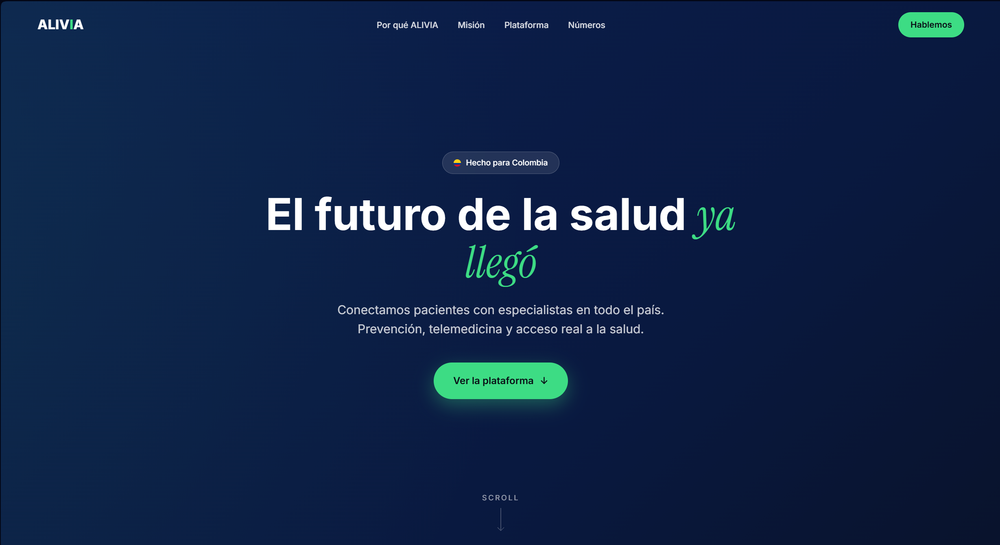
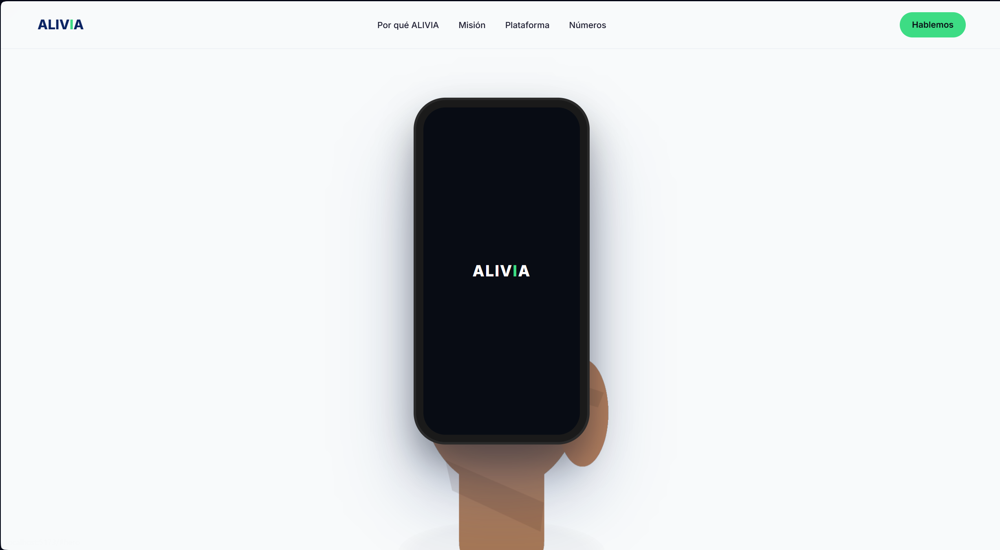
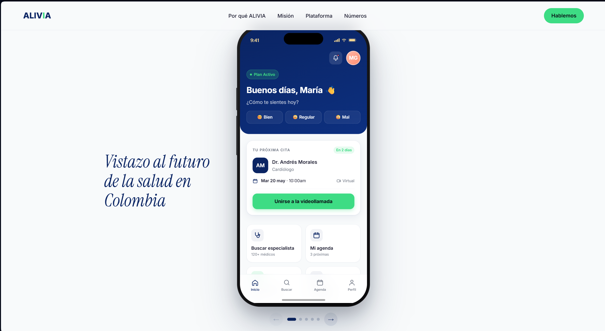

# ALIVIA Landing Page

Landing page moderna para ALIVIA, una plataforma de salud digital hecha para Colombia. El sitio está construido con React + Vite, CSS Modules, variables CSS globales, GSAP ScrollTrigger y Lenis.

## Screenshots

### Desktop



### mas imagenes



### mockup section




## Stack

- React
- Vite
- CSS Modules
- CSS custom properties en `src/styles/variables.css`
- GSAP + ScrollTrigger
- `@studio-freight/lenis`

## Project Structure

```txt
src/
├── assets/
│   ├── hand.png
│   └── video.mp4
├── components/
│   ├── CTAFinal/
│   ├── Hero/
│   ├── MissionVision/
│   ├── MockupSection/
│   ├── Navbar/
│   ├── Stats/
│   └── ValueProps/
├── styles/
│   └── variables.css
├── App.jsx
└── main.jsx
```

## Development

```bash
npm install
npm run dev
```

The local app runs on Vite, usually at:

```txt
http://localhost:5173
```

## Build

```bash
npm run build
```

## Hero Background Toggle

The footer includes a small hidden-style toggle that switches the hero background between:

- `video`: uses `src/assets/video.mp4`
- `placeholder`: uses the original animated CSS gradient

The selected mode is stored in `localStorage` under:

```txt
aliviaHeroMode
```
